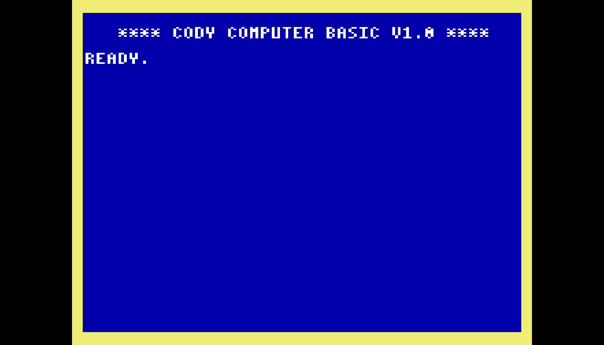

# cody_emulator

Emulate the [Cody Computer](https://www.codycomputer.org/).

Contains a 65C02 emulator and a re-implementation of the Cody firmware.

## Running from source
```
> cargo run --release -- --help
Usage: cody_emulator [OPTIONS] <FILE>

Arguments:
  <FILE>  Binary file

Options:
      --as-cartridge                 Load the binary file as a cartridge, expects the file to have a cartridge header
      --load-address <LOAD_ADDRESS>  Load address [default: 0xE000]
      --reset-vector <RESET_VECTOR>  Override Reset Vector (0xFFFC)
      --irq-vector <IRQ_VECTOR>      Override Interrupt Vector (0xFFFE)
      --nmi-vector <NMI_VECTOR>      Override Non-maskable Interrupt Vector (0xFFFA)
  -v, --verbose...                   Each time this option is added increases the default logging level
  -h, --help                         Print help
  -V, --version                      Print version
```

### Examples
Run Cody BASIC: `cargo run --release -- codybasic.bin`


Run Bitmap example: `cargo run --release -- --as-cartridge codybitmap.bin`


Run Codybros example: `cargo run --release -- --as-cartridge codybros.bin`

