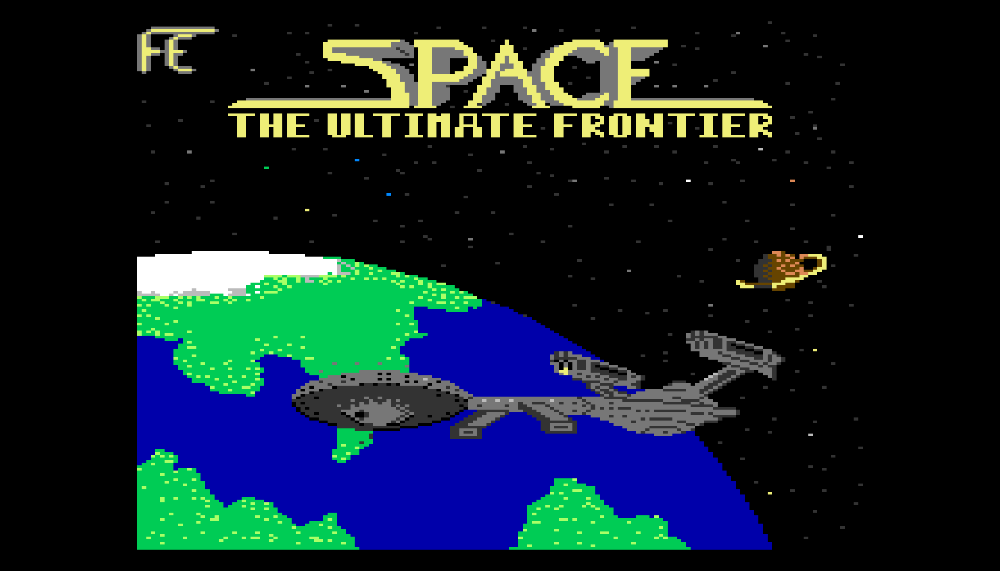

# cody_emulator

Emulate the [Cody Computer](https://www.codycomputer.org/).

Contains a 65C02 emulator and a re-implementation of the Cody firmware.

## Running from source
```
> cargo run --release -- --help
Usage: cody_emulator [OPTIONS] <FILE>

Arguments:
  <FILE>
          Binary file

Options:
      --as-cartridge
          Load the binary file as a cartridge, expects the file to have a cartridge header

      --load-address <LOAD_ADDRESS>
          Load address, default value is 0xE000

      --reset-vector <RESET_VECTOR>
          Override Reset Vector (0xFFFC)

      --irq-vector <IRQ_VECTOR>
          Override Interrupt Vector (0xFFFE)

      --nmi-vector <NMI_VECTOR>
          Override Non-maskable Interrupt Vector (0xFFFA)

      --uart1-source <UART1_SOURCE>
          Path of file used to fill the UART1 receive buffer with bytes

      --fix-newlines
          This option will normalize newlines when reading text data for the UART.
          
          Use this when your input text file might have CRLF-style line endings or to make sure it works for CodyBASIC's LOAD 1,0 command.

      --physical-keyboard
          Emulate the keyboard by physically mapping the cody keyboard, without respecting the host's layout

      --fast
          Run the cpu as fast as possible

  -v, --verbose...
          Each time this option is added increases the default logging level

  -h, --help
          Print help (see a summary with '-h')

  -V, --version
          Print version
```

### Examples
Run Cody BASIC: `cargo run --release -- codybasic.bin`


Run Bitmap example: `cargo run --release -- --as-cartridge codybitmap.bin`


Run Codybros example: `cargo run --release -- --as-cartridge codybros.bin`


Run Codylander example from UART: `cargo run --release -- --fix-newlines --uart1-source codylander.bas codybasic.bin`


Run Codycart example from UART: `cargo run --release -- --uart1-source codycart.bin codybasic.bin`


